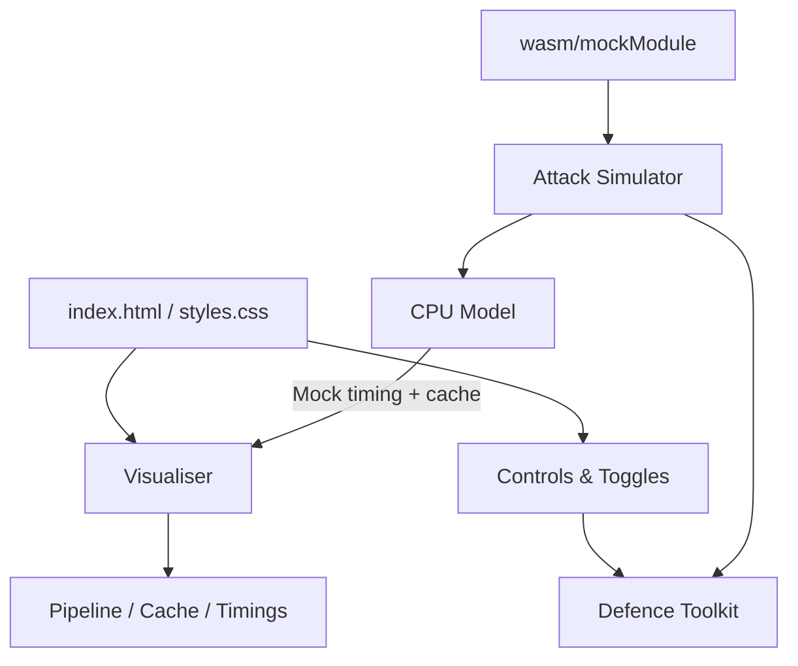

# Browser-Based Side-Channel Attack Simulator

A fully safe, educational, browser-based simulator inspired by Spectre/Meltdown-style behaviors. The project demonstrates speculative execution, cache timing differences, and mitigations using artificial timing deltas, mock cache states, and constrained WebAssembly. Real exploits are **not** included.

## Features
- **Side-Channel Simulation Engine**: Toy speculative execution model, branch predictor, and cache hierarchy with deterministic timing deltas.
- **CPU Microarchitecture Visualiser**: Pipeline view, cache hit/miss animations, and timing breakdowns.
- **Defence Toolkit**: Constant-time paths, jitter injection, fencing simulation, API disabling toggles, and detection heuristics.
- **Browser-Safe Implementation**: JavaScript modules and a tiny WebAssembly helper compiled from an inlined module; all data is synthetic.
- **Tooling**: Prettier, ESLint, Node tests, devcontainer, and CI workflow for consistent contributions.

## Architecture


## Quick start
1. Ensure Node 18+ and Python 3 are installed.
2. Install dependencies and dev tools:
   ```bash
   npm install
   ```
3. Start a local server (static assets only, no build step required):
   ```bash
   npm start
   ```
   Visit `http://localhost:8000`.
4. Run the demo buttons to compare baseline vs defended timings. Baseline mode intentionally disables every mitigation toggle to highlight the difference versus a defended run.

## Testing
Run logic tests using the built-in Node test runner:
```bash
npm test
```

Run linting to ensure consistent style and guard against mistakes:
```bash
npm run lint
```

Check formatting without writing changes:
```bash
npm run format:check
```

## Project structure
```
/README.md             – Overview, safety notes, and usage
/index.html            – Browser UI shell
/styles.css            – Layout, colors, and animations
/js/attack.js          – Speculative + cache timing simulator (safe)
/js/defence.js         – Mitigation toggles and timing guards
/js/visualiser.js      – UI rendering of pipeline, cache, and results
/js/cpuModel.js        – Branch predictor, cache model, and pipeline helpers
/wasm/mockModule.js    – Optional minimal WebAssembly helper
/docs/ARCHITECTURE.md  – Design, data flow, and extension points
/docs/USAGE.md         – Detailed usage patterns and scenarios
/tests/simulator.test.js – Logic regression tests
/package.json          – Scripts and dev tools
```

## Safety and scope
- All timing differences are artificial and clamped within safe bounds.
- Cache and memory references are mock arrays; no real kernel/user data is touched.
- WebAssembly is limited to deterministic loops with fixed outputs.
- The simulator is for education and demos only.

## Further documentation
- [Architecture](docs/ARCHITECTURE.md)
- [Usage guide](docs/USAGE.md)
- [API reference](docs/API.md)
- [Threat model](docs/THREAT_MODEL.md)

## Development environment
- Devcontainer definition in `.devcontainer/` pins Node.js 20 and installs ESLint/Prettier extensions by default.
- `.prettierrc.json` holds formatting defaults used by CI and the recommended editor setup.

## Contributing
See [CONTRIBUTING](CONTRIBUTING.md) and follow the [Code of Conduct](CODE_OF_CONDUCT.md). Keep changes within the safety constraints outlined here and in [SECURITY](SECURITY.md).

## License
MIT License. See [LICENSE](LICENSE).
